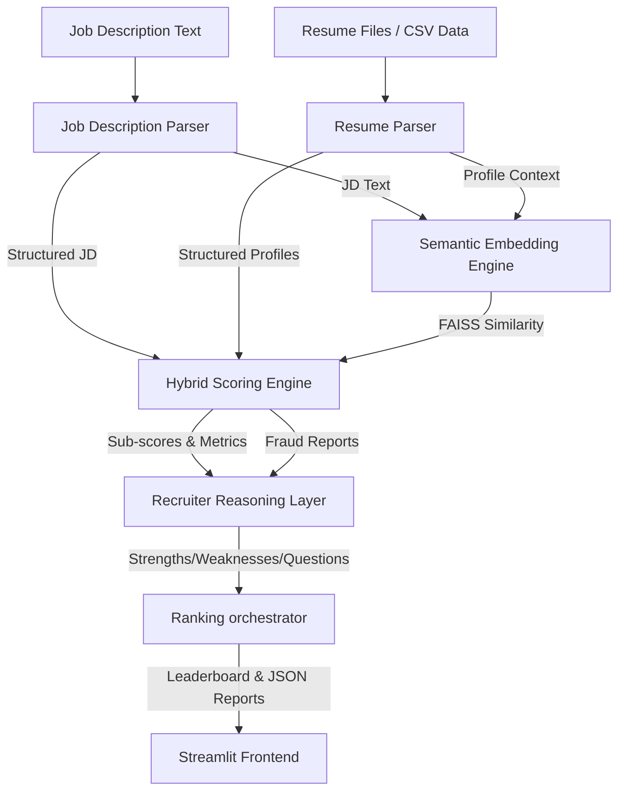

# AI Recruiter Copilot — Candidate Ranking System

An intelligent, multi-layered candidate parsing, scoring, ranking, and explanation engine designed to replicate the reasoning of an experienced technical recruiter.

Unlike standard semantic search tools, this platform evaluates candidates holistically across hard capabilities, soft signals, project complexity, experience relevance, and career growth potential, while actively detecting keyword-stuffing and copy-paste fraud.

---

## 🚀 Key Features

*   **Job Description Understanding Engine**: Extracts role, seniority benchmarks, required/preferred technologies, and soft traits using rule-based NLP patterns and structural LLM fallback.
*   **Signal-Extracting Resume Parser**: Processes PDFs, plain text, and batch CSVs to parse hard signals (skills, experience, education, tools) alongside soft signals (leadership, volunteering, initiative, hackathons) and behavioral records (GitHub presence, project volumes, continuous learning).
*   **Hybrid Scoring Engine**: Employs a customizable weighted scoring algorithm:
    $$\text{Final Score} = 0.35 \times \text{Semantic Match} + 0.20 \times \text{Skill Alignment} + 0.15 \times \text{Experience Relevance} + 0.10 \times \text{Project Quality} + 0.10 \times \text{Behavioral} + 0.10 \times \text{Growth}$$
*   **Recruiter-Style Reasoning Layer**: Utilizes generative LLM intelligence (OpenAI / Gemini) or robust heuristic templates to write strengths, weaknesses, a comprehensive fit summary, and custom interview questions for each candidate.
*   **Resume Fraud & Copy-Paste Detector**: Identifies candidate profiles that copy-paste the JD verbatim or list skills without backing them up in projects/experience descriptions, applying penalty offsets to protect recruiter trust.
*   **Interactive Recruiter Dashboard (Streamlit)**: Features:
    *   Adjustable recruiter persona templates (*Standard*, *Tech Lead Focus*, *Culture & Growth Focus*).
    *   "Anonymous Recruiting Mode" to hide names and contact details to reduce hiring bias.
    *   Interactive dataframes and Plotly horizontal component bar charts.
    *   Export buttons for CSV and JSON report logs.

---

## 🛠️ Architecture



---

## 📁 Project Structure

```
ai_recruiter_copilot/
│
├── requirements.txt            # Python dependencies
├── app.py                     # Streamlit Frontend UI
├── verify_backend.py          # Pipeline verification script
├── README.md                  # Project manual
│
├── data/                      # Test Datasets
│   ├── sample_jds/            # Target JDs (Senior Backend Engineer)
│   └── sample_resumes/        # Candidate profiles (PDFs, TXT, CSV)
│
├── outputs/                   # Export logs
│   ├── ranked_candidates.csv
│   └── candidate_evaluations.json
│
└── backend/                   # Python Modules
    ├── jd_parser.py           # Job description parser
    ├── resume_parser.py       # Resume data extractor
    ├── embeddings.py          # FAISS & SentenceTransformers
    ├── scorer.py              # Hybrid weighted scores & Fraud check
    ├── llm_reasoning.py       # Qualitative review generator
    └── utils.py               # Unified LLM client & PDF extractor
```

---

## ⚙️ Installation & Setup

1.  **Clone or create the workspace**:
    Ensure you are in the project folder:
    ```bash
    cd C:\Users\Nyx\.gemini\antigravity\scratch\ai_recruiter_copilot
    ```

2.  **Create and Activate Virtual Environment**:
    ```bash
    python -m venv .venv
    .venv\Scripts\activate
    ```

3.  **Install Dependencies**:
    ```bash
    pip install -r requirements.txt
    ```

4.  **Set Environment Variables (Optional)**:
    Create a `.env` file in the root directory to configure API keys:
    ```env
    OPENAI_API_KEY=your_openai_api_key_here
    GEMINI_API_KEY=your_gemini_api_key_here
    ```

---

## ⚡ Running the Platform

### Run Pipeline Verification
To verify the system's ranking modules against the test data (runs offline in mock mode):
```bash
python verify_backend.py
```
This will print the leaderboard details directly to the console and output reports into `outputs/`.

### Run Streamlit Recruiter Dashboard
Launch the interactive web platform:
```bash
streamlit run app.py
```
The browser will automatically open to `http://localhost:8501`.

---

## 🔮 Future Enhancements

*   **Interview Scheduling Automation**: Integrates with Google/Outlook calendars to auto-book follow-ups.
*   **Video Interview Transcription**: Extracts and parses signals directly from audio/video call feeds.
*   **GitHub Repository Code Quality Scanner**: Deeper repository evaluation, counting test suites, code architecture patterns, and contribution consistency.
# ai-recruiter-copilot
